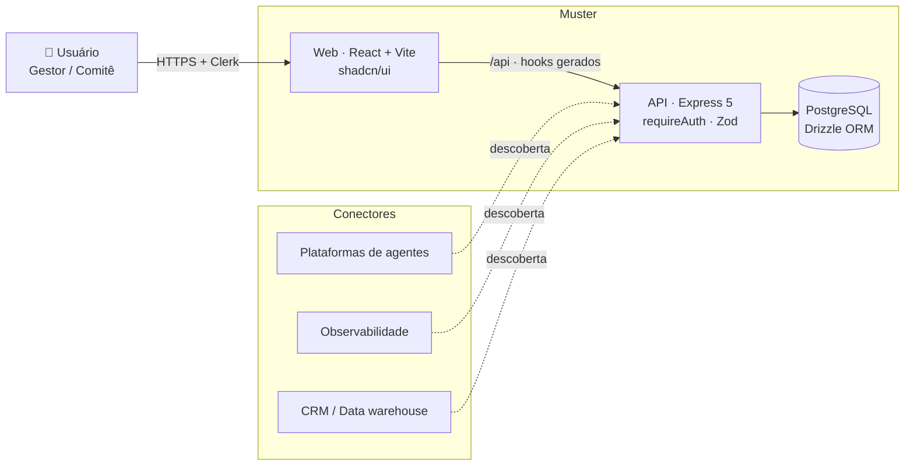
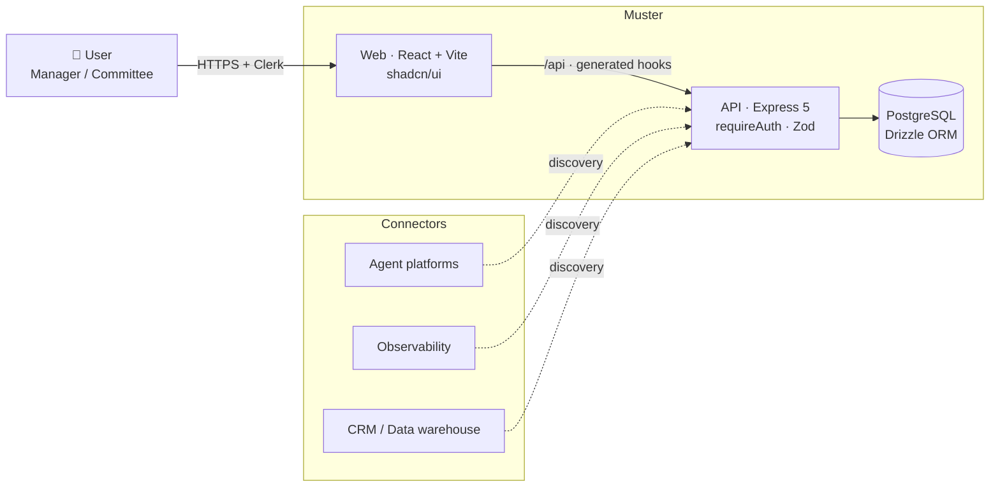

<div align="center">

<picture>
  <source media="(prefers-color-scheme: dark)" srcset="artifacts/cohort/public/brand/muster-lockup-on-dark.svg">
  <source media="(prefers-color-scheme: light)" srcset="artifacts/cohort/public/brand/muster-lockup-on-light.svg">
  
</picture>

### AI Workforce Operations

**Identidade, carteira de trabalho, avaliação em 5 camadas e governança para frotas de agentes de IA.**
*Identity, work record, 5-layer evaluation, and governance for fleets of AI agents.*

<br/>


<br/>

**🌐 [Português](#-português) · [English](#-english)**

</div>

---

<a name="-português"></a>

## 🇧🇷 Português

> O Muster é uma plataforma **plug-and-play** que dá às frotas de agentes de IA (multi-plataforma) **identidade, carteira de trabalho, análise de desempenho em 5 camadas e governança** — para decidir, com confiança, entre **Promover, Mentorar ou Aposentar** cada agente.

### Índice

- [O problema](#o-problema)
- [Funcionalidades](#funcionalidades)
- [Telas](#telas)
- [Arquitetura](#arquitetura)
- [Stack](#stack)
- [Estrutura do monorepo](#estrutura-do-monorepo)
- [Como rodar localmente](#como-rodar-localmente)
- [Variáveis de ambiente](#variáveis-de-ambiente)
- [Vocabulário do produto](#vocabulário-do-produto)

### O problema

Equipes estão colocando dezenas — em breve, milhares — de agentes de IA em produção, mas sem nenhuma camada de **RH e governança** para eles. Ninguém sabe ao certo quais agentes geram valor, quais estão "trapaceando" métricas, quem é o dono de cada um, ou quando aposentar um agente. O Muster trata cada agente como um **colaborador**: com carteira de trabalho, avaliação periódica, cadeia de responsabilidade e um veredito acionável.

### Funcionalidades

- **Admissão** — descubra agentes via conectores e admita-os na frota com **identidade** e **carteira de trabalho** (papel, fronteiras de autonomia, business case e donos).
- **Avaliação em 5 camadas** — análise de **eficácia, eficiência, adoção, governança e valor**, com pontuação reproduzível.
- **Veredito** — recomendação de **Promover / Mentorar / Aposentar**, com nível de confiança, janela de execução e plano de ação.
- **Detector de Vitória Ilusória** — sinaliza padrões enganosos de sucesso (ex.: ROI sobe enquanto a qualidade despenca).
- **Comitê / Governança da Frota** — dono de negócio, dono técnico e sponsor de governança por agente.
- **Conectores plug-ready** — catálogo de plataformas modelado para que conectores reais possam ser plugados sem mudar a UI.
- **Telemetria real (R6)** — agentes em execução reportam eventos (execução, erro, escalação, custo, tokens) via o SDK `@workspace/telemetry-reporter`; o Muster armazena em `agent_events`, agrega por janela (7/30/90d) e recalcula a avaliação de 5 camadas com **regras de decisão auditáveis** — o veredito passa a vir de dados reais, não de seed.

### Telas


| Frota (Portfólio) | Veredito + Detector de Vitória Ilusória |
| :---: | :---: |
|  |  |
| **Admissão (⚡ Pré-assessment)** | **Conectores (cadastro + descoberta real)** |
|  |  |
| **Biblioteca de Métricas** | **Carteira de Trabalho (probation)** |
|  |  |

### Arquitetura



### Stack

- **pnpm workspaces**, Node.js 24, TypeScript 5.9
- **API:** Express 5 (logging com pino)
- **Web:** React + Vite + wouter + TanStack Query + shadcn/ui + Clerk
- **DB:** PostgreSQL + Drizzle ORM
- **Validação:** Zod + drizzle-zod
- **Codegen de API:** Orval (a partir de um spec OpenAPI — contrato primeiro)
- **Telemetria:** SDK `@workspace/telemetry-reporter` (zero dependências, fire-and-forget) → `POST /agents/:id/events` → tabela `agent_events` → agregação em janelas + regras de decisão auditáveis
- **Build:** esbuild

### Estrutura do monorepo

```text
.
├── artifacts/            # Aplicações executáveis
│   ├── api-server/       # API Express (auth, rotas /api)
│   ├── cohort/           # Frontend web (React + Vite)
│   └── mockup-sandbox/   # Sandbox de componentes
├── lib/                  # Bibliotecas compartilhadas
│   ├── db/               # Schema Drizzle (fonte da verdade do banco)
│   ├── api-spec/         # Spec OpenAPI + codegen
│   ├── api-zod/          # Schemas Zod gerados
│   ├── api-client-react/ # Hooks React Query gerados
│   └── telemetry-reporter/ # SDK que agentes usam p/ reportar telemetria
├── scripts/              # Utilitários do workspace (inclui simulate-telemetry)
├── docs/screenshots/     # Imagens usadas neste README
└── pnpm-workspace.yaml
```

### Como rodar localmente

> Requer **Node.js 24**, **pnpm** e um **PostgreSQL** acessível via `DATABASE_URL`.

```bash
# 1. Copiar as variáveis de ambiente e preencher os valores
cp .env.example .env

# 2. Instalar dependências
pnpm install

# 3. Aplicar o schema do banco
pnpm --filter @workspace/db run push        # dev: push rápido do schema
# pnpm --filter @workspace/db run migrate     # prod: migrations versionadas (lib/db/drizzle)

# 4. Subir a API (porta via variável PORT)
pnpm --filter @workspace/api-server run dev

# 5. Em outro terminal, subir o frontend web
pnpm --filter @workspace/muster run dev
```

Comandos úteis:

```bash
pnpm run typecheck                               # typecheck de todos os pacotes
pnpm test                                         # testes (Vitest)
pnpm run build                                    # typecheck + build
pnpm --filter @workspace/db run generate          # gerar nova migration após mudar o schema
pnpm --filter @workspace/api-spec run codegen     # regenerar hooks e schemas a partir do OpenAPI
```

> **Deploy:** a API compila num bundle self-contained e há um `Dockerfile` multi-stage pronto (`docker build -t cohort-api .`). Rode as migrations como passo de release (`pnpm --filter @workspace/db run migrate`). O frontend é um build estático do Vite, com deploy separado (Vercel/Netlify).

### Variáveis de ambiente

Veja **[`.env.example`](.env.example)** para o catálogo completo (self-hosted vs Replit). Principais:

| Variável | Obrigatória | Descrição |
| --- | :---: | --- |
| `DATABASE_URL` | ✅ | String de conexão do PostgreSQL. |
| `PORT` | ✅ | Porta em que a API escuta. |
| `AI_INTEGRATIONS_OPENAI_API_KEY` · `AI_INTEGRATIONS_OPENAI_BASE_URL` | ✅ | Credenciais do OpenAI (análise de agentes). No Replit são injetadas. |
| `CLERK_SECRET_KEY` · `VITE_CLERK_PUBLISHABLE_KEY` | ✅¹ | Autenticação Clerk. |
| `GITHUB_TOKEN` | — | Import de repositórios GitHub privados (opcional). |

> ¹ No Replit a autenticação (Clerk) e o OpenAI são **gerenciados** — não precisa configurar chaves. Self-hosted, preencha as chaves acima com um projeto Clerk e uma chave OpenAI próprios.

### Vocabulário do produto

| Termo | Significado |
| --- | --- |
| **Frota** | O conjunto de agentes de IA sob gestão. |
| **Carteira de Trabalho** | A identidade do agente: papel, fronteiras, business case e donos. |
| **Admissão** | Descobrir e admitir um agente na frota. |
| **Veredito** | Recomendação: Promover, Mentorar ou Aposentar. |
| **Comitê** | Donos de negócio, técnico e sponsor de governança. |
| **Detector de Vitória Ilusória** | Sinaliza padrões enganosos de sucesso. |

<div align="right"><a href="#-português">⬆ topo</a></div>

---

<a name="-english"></a>

## 🇺🇸 English

> Muster is a **plug-and-play** platform that gives multi-platform fleets of AI agents **identity, a work record, 5-layer performance analysis, and governance** — so you can confidently decide whether to **Promote, Mentor, or Retire** each agent.

### Table of contents

- [The problem](#the-problem)
- [Features](#features)
- [Screens](#screens)
- [Architecture](#architecture)
- [Tech stack](#tech-stack)
- [Monorepo structure](#monorepo-structure)
- [Running locally](#running-locally)
- [Environment variables](#environment-variables)
- [Product vocabulary](#product-vocabulary)

### The problem

Teams are shipping dozens — soon thousands — of AI agents to production with **no HR or governance layer** for them. Nobody really knows which agents create value, which are gaming their metrics, who owns each one, or when to retire one. Muster treats every agent like an **employee**: with a work record, periodic evaluation, a chain of responsibility, and an actionable verdict.

### Features

- **Admission** — discover agents through connectors and admit them to the fleet with an **identity** and a **work record** (role, autonomy boundaries, business case, and owners).
- **5-layer evaluation** — analysis of **effectiveness, efficiency, adoption, governance, and value**, with reproducible scoring.
- **Verdict** — a **Promote / Mentor / Retire** recommendation, with confidence level, execution window, and action plan.
- **Illusory Victory Detector** — flags deceptive success patterns (e.g. ROI rising while quality collapses).
- **Committee / Fleet Governance** — a business owner, technical owner, and governance sponsor per agent.
- **Plug-ready connectors** — a platform catalog modeled so real connectors can be swapped in without UI changes.
- **Real telemetry (R6)** — running agents report events (execution, error, escalation, cost, tokens) through the `@workspace/telemetry-reporter` SDK; Muster stores them in `agent_events`, aggregates per window (7/30/90d) and recomputes the 5-layer evaluation with **auditable decision rules** — verdicts come from real data, not seeds.

### Screens


| Fleet (Portfolio) | Verdict + Illusory Victory Detector |
| :---: | :---: |
|  |  |
| **Admission (⚡ Pre-assessment)** | **Connectors (register + real discovery)** |
|  |  |
| **Metric Library** | **Work Record (probation)** |
|  |  |

### Architecture



### Tech stack

- **pnpm workspaces**, Node.js 24, TypeScript 5.9
- **API:** Express 5 (pino logging)
- **Web:** React + Vite + wouter + TanStack Query + shadcn/ui + Clerk
- **DB:** PostgreSQL + Drizzle ORM
- **Validation:** Zod + drizzle-zod
- **API codegen:** Orval (from an OpenAPI spec — contract first)
- **Telemetry:** `@workspace/telemetry-reporter` SDK (zero-dependency, fire-and-forget) → `POST /agents/:id/events` → `agent_events` table → windowed aggregation + auditable decision rules
- **Build:** esbuild

### Monorepo structure

```text
.
├── artifacts/            # Runnable applications
│   ├── api-server/       # Express API (auth, /api routes)
│   ├── cohort/           # Web frontend (React + Vite)
│   └── mockup-sandbox/   # Component sandbox
├── lib/                  # Shared libraries
│   ├── db/               # Drizzle schema (DB source of truth)
│   ├── api-spec/         # OpenAPI spec + codegen
│   ├── api-zod/          # Generated Zod schemas
│   ├── api-client-react/ # Generated React Query hooks
│   └── telemetry-reporter/ # SDK agents embed to report telemetry
├── scripts/              # Workspace utilities (includes simulate-telemetry)
├── docs/screenshots/     # Images used in this README
└── pnpm-workspace.yaml
```

### Running locally

> Requires **Node.js 24**, **pnpm**, and a **PostgreSQL** reachable via `DATABASE_URL`.

```bash
# 1. Copy the environment variables and fill in the values
cp .env.example .env

# 2. Install dependencies
pnpm install

# 3. Apply the database schema
pnpm --filter @workspace/db run push        # dev: fast schema push
# pnpm --filter @workspace/db run migrate     # prod: versioned migrations (lib/db/drizzle)

# 4. Start the API (port via the PORT variable)
pnpm --filter @workspace/api-server run dev

# 5. In another terminal, start the web frontend
pnpm --filter @workspace/muster run dev
```

Useful commands:

```bash
pnpm run typecheck                               # typecheck every package
pnpm test                                         # run tests (Vitest)
pnpm run build                                    # typecheck + build
pnpm --filter @workspace/db run generate          # generate a new migration after schema changes
pnpm --filter @workspace/api-spec run codegen     # regenerate hooks and schemas from OpenAPI
```

> **Deploy:** the API compiles to a self-contained bundle and ships a multi-stage `Dockerfile` (`docker build -t cohort-api .`). Run migrations as a release step (`pnpm --filter @workspace/db run migrate`). The frontend is a static Vite build, deployed separately (Vercel/Netlify).

### Environment variables

See **[`.env.example`](.env.example)** for the full catalog (self-hosted vs Replit). Key ones:

| Variable | Required | Description |
| --- | :---: | --- |
| `DATABASE_URL` | ✅ | PostgreSQL connection string. |
| `PORT` | ✅ | Port the API listens on. |
| `AI_INTEGRATIONS_OPENAI_API_KEY` · `AI_INTEGRATIONS_OPENAI_BASE_URL` | ✅ | OpenAI credentials (agent analysis). Injected on Replit. |
| `CLERK_SECRET_KEY` · `VITE_CLERK_PUBLISHABLE_KEY` | ✅¹ | Clerk authentication. |
| `GITHUB_TOKEN` | — | Importing private GitHub repos (optional). |

> ¹ On Replit, authentication (Clerk) and OpenAI are **managed** — no key configuration needed. Self-hosted, fill in the keys above with your own Clerk project and OpenAI key.

### Product vocabulary

| Term | Meaning |
| --- | --- |
| **Frota** (Fleet) | The set of AI agents under management. |
| **Carteira de Trabalho** (Work Record) | The agent's identity: role, boundaries, business case, owners. |
| **Admissão** (Admission) | Discovering and admitting an agent into the fleet. |
| **Veredito** (Verdict) | Recommendation: Promote, Mentor, or Retire. |
| **Comitê** (Committee) | Business, technical, and governance-sponsor owners. |
| **Detector de Vitória Ilusória** (Illusory Victory Detector) | Flags deceptive success patterns. |

<div align="right"><a href="#-english">⬆ top</a></div>

---

<div align="center">

A interface do Muster é **inteiramente em português do Brasil**, com o design *Trincheira* — papel creme quente, verde-floresta e tipografia serifada editorial.
<br/>
*Muster's interface is **entirely in Brazilian Portuguese**, with the "Trincheira" design — warm cream paper, forest green, and editorial serif typography.*

</div>
