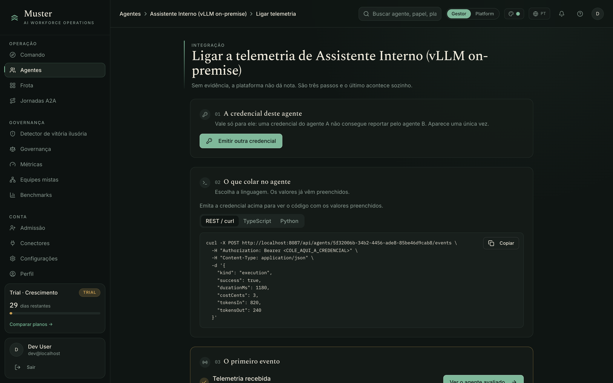
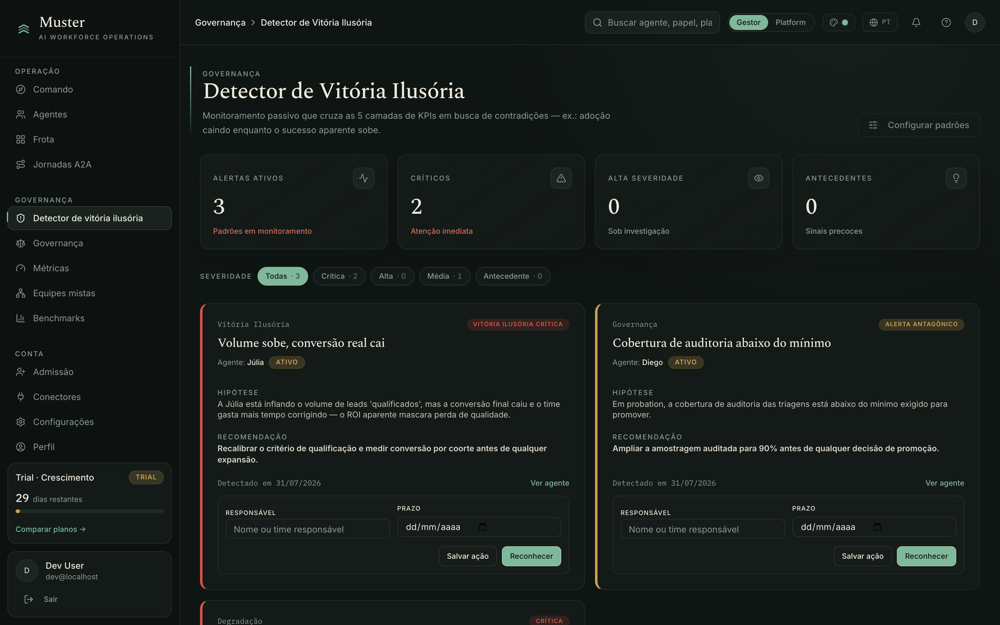
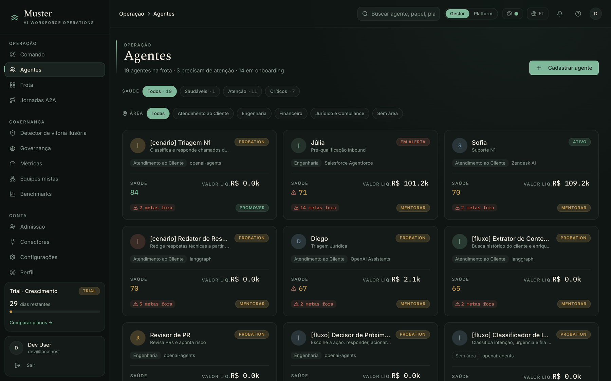
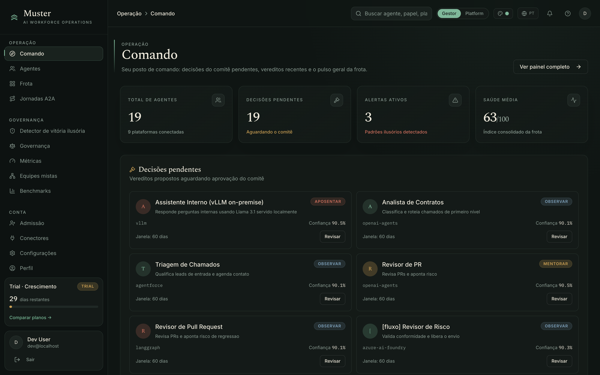
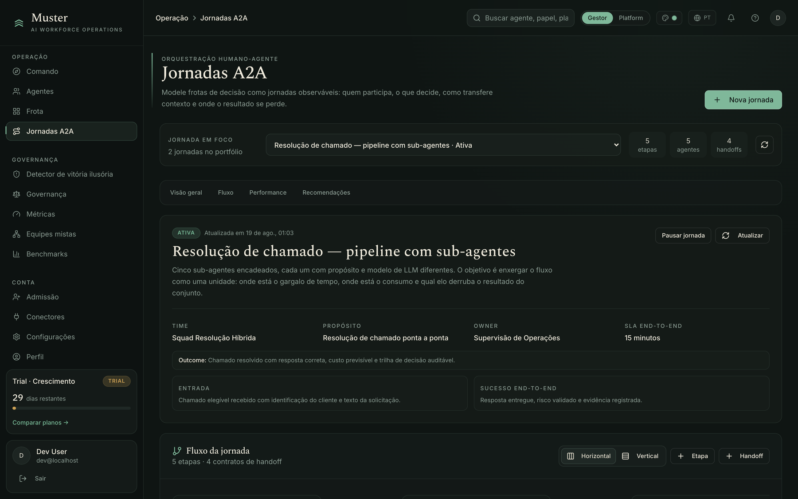
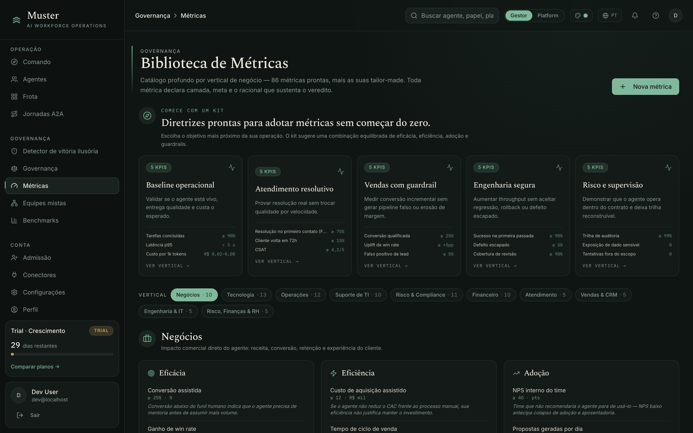
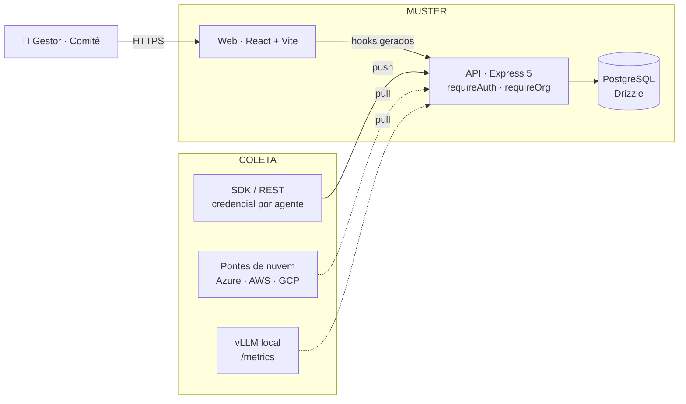

<div align="center">

<picture>
  <source media="(prefers-color-scheme: dark)" srcset="artifacts/cohort/public/brand/muster-lockup-on-dark.svg">
  <source media="(prefers-color-scheme: light)" srcset="artifacts/cohort/public/brand/muster-lockup-on-light.svg">
  
</picture>

### Seus agentes de IA já trabalham. Alguém avalia o desempenho deles?

**O Muster dá identidade, carteira de trabalho e avaliação de desempenho a frotas de agentes de IA — e um veredito: promover, mentorar ou aposentar.**

<br/>


<br/>


**🌐 [Português](#-português) · [English](#-english)**

</div>

---

## 🇧🇷 Português

### 🎯 A ideia em uma frase

Uma empresa contrata um agente de IA como contrata uma pessoa — define o papel, dá acesso a sistema, coloca em produção. E aí para. Não há histórico, não há revisão de desempenho, não há dono. Quando o agente falha, ninguém sabe desde quando. Quando acerta, ninguém consegue provar.

O Muster trata cada agente como **profissional**: carteira de trabalho, telemetria de execução, avaliação em cinco camadas e um veredito que alguém assina.

### 🚫 A decisão que define o produto

**Sem evidência, o Muster não dá nota.**

Todo painel de IA que você já viu calcula uma média sobre qualquer coisa que receber. O Muster confere a procedência antes de pontuar:

| Estado | O que significa |
| :--- | :--- |
| `telemetry` | Telemetria real e suficiente. A nota vale. |
| `mixed` | Parte real, parte declarada. A nota vem com a ressalva na tela. |
| `seeded` | Só valor de demonstração. Não serve para decidir. |
| `none` | Sem evidência. **A plataforma se recusa a pontuar.** |

É ruim para a demonstração e ótimo para a auditoria — e é a razão de o agente recém-cadastrado nascer sem nota.

### 🔌 Como um agente entra

São **duas etapas**, e confundi-las é o erro mais comum: cadastrar cria a ficha; ligar a telemetria é o que produz a avaliação.

**1 · Cadastrar** — três formas:

| Forma | Como | Quando usar |
| :--- | :--- | :--- |
| Manual | Tela de admissão: papel, área, autonomia, o que deve e não deve fazer | Poucos agentes, ou você quer controle total da ficha |
| A partir do código | Cole o código ou aponte um repositório; a IA propõe a ficha para você revisar | O agente já existe e você tem o código |
| Varredura | Um conector traz rascunhos para aprovar em lote | Muitos agentes de uma vez |

**2 · Ligar a telemetria** — três caminhos:

| Caminho | Como funciona | Estado |
| :--- | :--- | :--- |
| **O agente reporta** | SDK ou REST, com credencial própria por agente. Duas linhas no agente | ✅ no ar |
| **A nuvem entrega** | Azure, AWS e Google — lê o rastro que a nuvem já grava, sem tocar no agente | ⚠️ validado só contra amostras, nunca contra conta real |
| **Coleta local** | Servidor vLLM on-premise — lê o `/metrics` que ele já publica. Sem sidecar | ✅ no ar |

> A tela **Ligar telemetria** conduz o passo 2: emite a credencial, entrega o trecho pronto para colar em `curl`, TypeScript ou Python, e fica esperando o primeiro evento chegar — confirmando sozinha quando chega.



### 📊 Como a nota é formada

Cinco camadas, duas perguntas:

| Camada | Pergunta |
| :--- | :--- |
| **Eficácia** | O agente resolve mesmo o problema? |
| **Eficiência** | Faz isso em tempo e custo viáveis? |
| **Adoção** | A organização realmente usa? |
| **Governança** | Dá para auditar o que ele decidiu? |
| **Valor** | O que entra compensa o que sai? |

**Produtividade** = eficiência + adoção · **Propósito** = eficácia + governança + valor

Um agente pode ser altamente produtivo e não ter propósito nenhum: rápido, barato e resolvendo com excelência o problema errado. Separar as duas perguntas é o que impede a frota de comemorar o número errado.

### 🕵️ Detector de Vitória Ilusória

Nenhuma camada sozinha acusa um agente que está enganando o painel. O detector cruza as cinco em busca de contradição — *"volume sobe, conversão real cai"* — e entrega hipótese, recomendação, responsável e prazo. Não só o alerta.



### 🏢 Multi-tenant: organização e área

- **Organização** é a fronteira de isolamento. Dado de uma empresa nunca aparece para outra, e isso é garantido por um teste que varre o código-fonte reprovando qualquer leitura sem filtro.
- **Área** é a estrutura interna: Atendimento, Financeiro, Engenharia, Jurídico — cada uma com dono, orçamento e centro de custo. Área **não** é fronteira de segurança: quem enxerga a organização enxerga todas as áreas dela.



### ⚡ Demais recursos

- **🔗 Jornadas A2A** — cinco sub-agentes encadeados: etapas, contratos de handoff e telemetria por passo, para achar o elo que derruba o conjunto. → [`docs/JORNADAS-A2A.md`](docs/JORNADAS-A2A.md)
- **📚 Catálogo de 86 métricas** — cada uma com instrução de instrumentação pronta para colar.
- **✅ Plano de ação rastreável** — o veredito vira ações com status, e concluir exige evidência.
- **🔑 Credencial por agente** — `msk_live_…`, SHA-256 em repouso. A do agente A não reporta pelo agente B.
- **🌐 Trilíngue** — pt-BR (canônico), inglês e espanhol.

<details>
<summary><b>📸 Mais telas</b></summary>

| Comando | Jornadas A2A |
| :---: | :---: |
|  |  |
| **Biblioteca de métricas** | **Admissão** |
|  |  |

</details>

### 🏗️ Arquitetura


```mermaid
flowchart LR
    U[👤 Gestor · Comitê] -->|HTTPS| W

    subgraph MUSTER
      W[Web · React + Vite]
      A[API · Express 5<br/>requireAuth · requireOrg]
      DB[(PostgreSQL<br/>Drizzle)]
      W -->|hooks gerados| A
      A --> DB
    end

    subgraph COLETA
      P1[SDK / REST<br/>credencial por agente]
      P2[Pontes de nuvem<br/>Azure · AWS · GCP]
      P3[vLLM local<br/>/metrics]
    end

    P1 -->|push| A
    P2 -.->|pull| A
    P3 -.->|pull| A
```

### 🧰 Stack

| Camada | Tecnologia |
| :--- | :--- |
| Monorepo | pnpm workspaces · Node.js 24 · TypeScript 5.9 |
| API | Express 5 · pino · Zod |
| Web | React · Vite · wouter · TanStack Query · shadcn/ui · Clerk |
| Banco | PostgreSQL · Drizzle ORM · migrações versionadas com reversão |
| Contrato | OpenAPI → Orval (spec primeiro, código depois) |
| Testes | Vitest · 210 testes · portão e2e em 401 ms |

### 🚀 Rodar localmente

> Requer **Node.js 24**, **pnpm** e **Docker** (para o PostgreSQL).

```bash
# 1. Variáveis de ambiente
cp .env.example .env

# 2. Dependências
pnpm install

# 3. Banco
docker compose up -d postgres
pnpm --filter @workspace/db run push

# 4. API (porta 8087)
pnpm --filter @workspace/api-server run dev

# 5. Em outro terminal, a web (porta 5173)
pnpm --filter @workspace/muster run dev
```

Abra **http://localhost:5173**. Guia passo a passo em [`docs/DEMO-LOCAL.md`](docs/DEMO-LOCAL.md).

**Demonstrações prontas:**

```bash
pnpm --filter @workspace/scripts run demo:integrar   # integra um agente ao vivo, narrado
pnpm --filter @workspace/scripts run demo:fluxo      # jornada com sub-agentes
pnpm --filter @workspace/scripts run bridge:vllm -- --fixture --dry-run   # coleta local, sem GPU
```

### 📁 Estrutura

```text
.
├── artifacts/
│   ├── api-server/       # API Express — rotas, avaliação, isolamento por org
│   ├── cohort/           # Web (React + Vite)
│   └── agent-runner/     # Execução de agente para os testes de ponta a ponta
├── lib/
│   ├── db/               # Schema Drizzle + migrações (fonte da verdade)
│   ├── api-spec/         # OpenAPI + codegen
│   ├── api-zod/          # Schemas Zod gerados
│   ├── api-client-react/ # Hooks React Query gerados
│   └── telemetry-reporter/ # SDK que o agente do cliente usa
├── scripts/              # Demos, pontes de coleta, validação
└── docs/                 # Guias e contratos
```

### 📖 Documentação

| Documento | Assunto |
| :--- | :--- |
| [`DEMO-LOCAL.md`](docs/DEMO-LOCAL.md) | Subir tudo do zero, passo a passo |
| [`COLETA-LOCAL-VLLM.md`](docs/COLETA-LOCAL-VLLM.md) | Monitorar agente on-premise via vLLM |
| [`INTEGRACAO-PLATAFORMAS-EXTERNAS.md`](docs/INTEGRACAO-PLATAFORMAS-EXTERNAS.md) | Pontes de nuvem |
| [`JORNADAS-A2A.md`](docs/JORNADAS-A2A.md) | Contrato das jornadas |
| [`VALIDACAO-MVP.md`](docs/VALIDACAO-MVP.md) | O que o portão de ponta a ponta cobre |

### ⚖️ Estado atual — o que ainda não existe

Coerente com o produto: dizer o que não se sabe, em vez de omitir.

- **Nenhuma frota real passou pela plataforma.** A telemetria existente é de teste e demonstração.
- **As pontes de nuvem nunca rodaram contra uma conta real** — estão validadas contra amostras de resposta dos três provedores.
- **Credenciais de conector ficam em texto puro** no banco. Antes de qualquer piloto real, precisam ser cifradas.
- **Não há política de retenção** configurável — lacuna de LGPD assumida.
- **Não há escopo de permissão por perfil**: quem entra na organização pode aprovar veredito.

---

## 🇺🇸 English

### 🎯 The idea in one sentence

A company hires an AI agent the way it hires a person — defines the role, grants system access, ships it to production. And then it stops. No work record, no performance review, no owner. When the agent fails, nobody knows since when. When it succeeds, nobody can prove it.

Muster treats each agent as a **professional**: a work record, execution telemetry, a five-layer evaluation and a verdict someone signs.

### 🚫 The decision that defines the product

**Without evidence, Muster won't score.**

Every AI dashboard you've seen averages whatever it receives. Muster checks provenance first:

| State | Meaning |
| :--- | :--- |
| `telemetry` | Real, sufficient telemetry. The score stands. |
| `mixed` | Partly real, partly declared. The score ships with the caveat on screen. |
| `seeded` | Demo values only. Not fit for a decision. |
| `none` | No evidence. **The platform refuses to score.** |

Bad for the demo, excellent for the audit — and the reason a freshly registered agent starts with no score.

### 🔌 How an agent gets in

**Two steps**, and conflating them is the common mistake: registering creates the record; connecting telemetry is what produces the evaluation.

**1 · Register** — three ways: manually, from the agent's source code (AI drafts the record for you to review), or via bulk connector discovery.

**2 · Connect telemetry** — three paths:

| Path | How it works | State |
| :--- | :--- | :--- |
| **Agent reports** | SDK or plain REST, per-agent credential. Two lines in the agent | ✅ live |
| **Cloud delivers** | Azure, AWS and Google — reads the trail the cloud already records | ⚠️ fixture-validated, never run against a real account |
| **Local collection** | On-premise vLLM — reads the `/metrics` it already publishes. No sidecar | ✅ live |

> The **Connect telemetry** screen walks step 2: issues the credential, hands you a ready-to-paste snippet in `curl`, TypeScript or Python, then waits for the first event and confirms on its own when it lands.

### 📊 How the score is formed

Five layers, two questions: **Efficacy** (does it actually solve it?), **Efficiency** (at viable time and cost?), **Adoption** (does the org really use it?), **Governance** (can you audit what it decided?), **Value** (does the return justify the spend?).

**Productivity** = efficiency + adoption · **Purpose** = efficacy + governance + value

An agent can be highly productive with no purpose at all: fast, cheap and excellently solving the wrong problem.

### 🏢 Multi-tenant: organization and area

**Organization** is the isolation boundary — one company's data never surfaces for another, enforced by a test that scans the source and fails any unscoped read. **Area** is internal structure (Support, Finance, Engineering), each with an owner and a cost center. Area is **not** a security boundary.

### ⚡ Other capabilities

- **🔗 A2A journeys** — chained sub-agents with handoff contracts and per-step telemetry → [`docs/JORNADAS-A2A.md`](docs/JORNADAS-A2A.md)
- **📚 86-metric catalog** — each with ready-to-paste instrumentation guidance
- **✅ Traceable action plan** — verdicts become tracked actions; closing one requires evidence
- **🔑 Per-agent credentials** — `msk_live_…`, SHA-256 at rest
- **🌐 Trilingual** — pt-BR (canonical), English, Spanish

### 🚀 Running locally

> Requires **Node.js 24**, **pnpm** and **Docker**.

```bash
cp .env.example .env
pnpm install
docker compose up -d postgres
pnpm --filter @workspace/db run push
pnpm --filter @workspace/api-server run dev      # API on 8087
pnpm --filter @workspace/muster run dev          # Web on 5173
```

Step-by-step guide in [`docs/DEMO-LOCAL.md`](docs/DEMO-LOCAL.md).

### ⚖️ Current state — what does not exist yet

- **No real fleet has run through the platform.** Existing telemetry is test and demo data.
- **The cloud bridges have never touched a real account.**
- **Connector credentials are stored in plaintext** — must be encrypted before any real pilot.
- **No configurable retention policy** — an acknowledged privacy gap.
- **No per-role permission scopes**: anyone in the organization can approve a verdict.

---

<div align="center">

**Muster** · AI Workforce Operations
Bruno Oliveira · [bruoacks@gmail.com](mailto:bruoacks@gmail.com)

</div>
